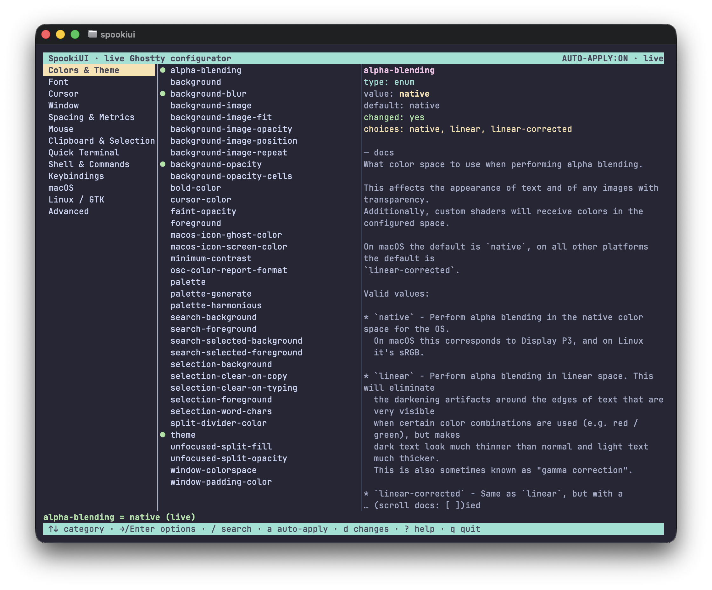

> [!CAUTION]
> **Experimental AI-generated fork.** This repository is a fork of
> [mattj85/SpookiUI](https://github.com/mattj85/SpookiUI) (a single-file Python
> tool) that was ported to Go in one shot by an AI agent, as an experiment to
> test the one-shot capability of Kimi K3. The very first build of the port
> already worked, except for one background rendering issue (blank areas of the
> screen repainting with the wrong background color), which has since been
> fixed. The goal of this fork is that the Go port behaves **exactly** like the
> Python version — full behavioral parity with upstream. The Python original,
> [`spookiui.py`](spookiui.py), is kept in this repo as the reference
> implementation.

# SpookiUI

[](https://pkg.go.dev/github.com/lbe/SpookiUI)
[](https://opensource.org/licenses/MIT)
[](https://go.dev/dl/)
[](https://goreportcard.com/report/github.com/lbe/SpookiUI)
[](https://github.com/lbe/SpookiUI/actions/workflows/release.yml)
[](https://github.com/lbe/SpookiUI/actions/workflows/ci.yml)
[](https://codecov.io/gh/lbe/SpookiUI)

A **live configurator for the [Ghostty](https://ghostty.org) terminal**. Browse
and edit *every* option Ghostty supports from an interactive terminal UI, and
watch your changes apply **live** — when you run it inside a Ghostty window, the
very terminal you're in repaints as you edit.

This is the Go port of [mattj85/SpookiUI](https://github.com/mattj85/SpookiUI);
all credit for the original design and implementation goes upstream.



```
./spookiui
```

<sub>SpookiUI is a single, dependency-free Go binary (standard library only, no
CGO) for macOS and Linux. It needs the `ghostty` binary on your `PATH` (or in
`/Applications/Ghostty.app`).</sub>

---

## Installation

### Download a release binary (recommended)

Pre-built binaries for macOS and Linux (`spookiui_darwin_amd64`,
`spookiui_darwin_arm64`, `spookiui_linux_amd64`, `spookiui_linux_arm64`) are
published on the
[GitHub releases page](https://github.com/lbe/SpookiUI/releases), alongside a
`checksums.txt` with SHA-256 hashes. Download the one for your platform, verify
it, and put it on your `PATH`:

```bash
curl -LO https://github.com/lbe/SpookiUI/releases/latest/download/spookiui_darwin_arm64
curl -LO https://github.com/lbe/SpookiUI/releases/latest/download/checksums.txt
grep spookiui_darwin_arm64 checksums.txt | shasum -a 256 -c -
chmod +x spookiui_darwin_arm64
mv spookiui_darwin_arm64 ~/.local/bin/spookiui
```

Once installed, `spookiui update` self-updates in place to the newest release,
verifying the download against the published SHA-256 checksums.

### Build from source

SpookiUI is a single `main.go` using **only the Go standard library** — no
third-party dependencies, no CGO. You need Go 1.26+ (see
[`go.mod`](go.mod)):

```bash
git clone https://github.com/lbe/SpookiUI.git
cd SpookiUI
go build -o spookiui .
./spookiui
```

### The Python version's installer

The repo also carries `install.sh` / `uninstall.sh` from upstream — note that
these install the **Python** version (they verify Python 3.8+ and symlink
`spookiui.py` into a bin directory as a `spookiui` command):

```bash
./install.sh                     # installs the Python script to ~/.local/bin
PREFIX=/usr/local ./install.sh   # system-wide (may need sudo)
```

They are kept for parity with upstream and for running the reference
implementation; you do not need them for the Go binary.

### Homebrew (macOS & Linux)

A Homebrew formula lives in [`homebrew/spookiui.rb`](homebrew/spookiui.rb).
**It currently installs the Python version** (it depends on `python@3.12` and
wraps `spookiui.py`). Once it's published to a tap repo named
`homebrew-spookiui`, install with:

```bash
brew install mattj85/spookiui/spookiui
```

Homebrew installs are updated with `brew upgrade spookiui`; the in-app updater
detects a Homebrew install and defers to it.

## Why it exists

Ghostty is configured through a plain-text file (`~/.config/ghostty/config`) and
**cannot auto-reload on file change** — you have to trigger a reload yourself.
SpookiUI closes that loop: it writes the config file *and* triggers a Ghostty
reload for you — clicking the **Reload Configuration** menu item on macOS, or
sending the running process the **SIGUSR2** signal it reloads on under Linux —
so editing feels live. It runs on both macOS and Linux.

Every option is discovered **dynamically** from your installed Ghostty
(`ghostty +show-config --default --docs`), so the tool always matches your
version — nothing is hard-coded. On this machine that's ~200 options across 13
categories. Options that only apply to the *other* operating system (macOS-only
settings on Linux, GTK/X11 settings on macOS) are **hidden automatically** so you
only ever see what's relevant to the machine you're on.

## The live loop

```
 you edit a value ─▶ SpookiUI writes the config file
                          │
                          ├─▶ validates it with `ghostty +validate-config`
                          │       (an invalid value is rejected & rolled back)
                          │
                          └─▶ reloads Ghostty ─▶ your terminal repaints
                                  (macOS: "Reload Configuration" menu item via
                                   AppleScript · Linux: SIGUSR2 to the process)
```

- **Safe:** every change is validated by Ghostty itself before it's saved. Bad
  values never reach your config.
- **Reversible:** a dated backup (`config.spookiui.YYYYMMDD.bak`) is made on the
  first change of the day, the TUI can revert an entire session with `R`, and you
  can wipe the config back to Ghostty's built-in defaults with `X` (a backup is
  still kept).
- **Live preview:** while picking a theme, font, or enum value, each highlighted
  option is applied as you scroll — cancel and it snaps back to where you were.

## Live reload by platform

Ghostty can't watch its config file for changes, so SpookiUI triggers the reload
for you. How that happens — and what that needs — depends on your OS:

| Platform | How the reload fires | Requirements |
| --- | --- | --- |
| **macOS** | Clicks the **Reload Configuration** menu item via AppleScript (`osascript`) | Ghostty must be running; your terminal needs **Accessibility** permission (*System Settings → Privacy & Security → Accessibility*). Ghostty is located on `PATH` or at `/Applications/Ghostty.app`. |
| **Linux** | Sends **`SIGUSR2`** to the running Ghostty process(es), which Ghostty reloads on | Ghostty must be running; `pgrep` (from `procps`/`procps-ng`, present on essentially every distro) is used to find it. No extra permission needed. Works on any distribution — detection is generic (`runtime.GOOS`), with no distro-specific code. |
| **Other** | *No auto-reload* — the file is still written and validated | Trigger your own `reload_config` keybind in Ghostty to apply. |

On **Linux**, Ghostty is found via `PATH`, falling back to `/usr/bin/ghostty`
and `/usr/local/bin/ghostty`. The Go binary itself has no runtime dependencies;
live reload additionally needs `pgrep` and a running Ghostty instance.

If a reload can't be triggered (Ghostty isn't running, missing permission, or an
unsupported platform), your change is **still written and validated safely** —
SpookiUI just tells you to reload manually. A few options (e.g. `language`) can't
be applied without a restart at all; the UI flags these as *needs restart* /
*new windows only* so there are no surprises.

## The TUI

```
 SpookiUI · live Ghostty configurator          AUTO-APPLY:ON · live
 Colors & Theme    │ ● theme            Catppuccin Mocha │ theme
 Font              │   background        #1e1e2e          │ type: theme
 Cursor            │   foreground        #cdd6f4          │ value: Catppuccin…
 Window            │ ● background-opacity 0.95            │ ─ docs ───────────
 …                 │   …                                  │ Set the color …
```

| Key | Action |
| --- | --- |
| `↑`/`↓` or `j`/`k` | move · `Tab` switch pane |
| `→`/`Enter` | into options / **edit** the selected option |
| `←` | back to categories |
| `/` | search all options by name or documentation |
| `u` | reset the selected option to its default |
| `a` | toggle **auto-apply** (live ↔ staged) |
| `s` | save + reload now · `r` re-trigger reload |
| `R` | revert everything to session start |
| `X` | wipe config & restore **all** Ghostty defaults (backup kept) |
| `U` | update SpookiUI in place to the latest release |
| `p` | **profiles** — save / load / delete named configs · `t` toggles light↔dark |
| `c` | **config check** (doctor) — health-check for issues |
| `v` | **utils** — one-shot fixes (e.g. **Fix SSH**) |
| `d` | show everything you've changed |
| `?` | help · `q` quit |

When your terminal font is a **Nerd Font**, each category in the left column
gets an icon (palette, font, cursor, apple/linux, …). SpookiUI detects this from
Ghostty's `font-family`; if no Nerd Font is set it shows a one-time note on how
to install one for your platform and then runs without icons. Force it either
way with `SPOOKIUI_ICONS=1` / `SPOOKIUI_ICONS=0`.

Editors are typed to each option:

- **booleans** toggle instantly
- **enums / font** open a searchable picker with live preview, listing *every*
  valid choice Ghostty documents (e.g. all 11 `macos-icon` styles)
- **theme** opens the picker with a **live colour card** for the highlighted
  theme — its 16-colour palette and a foreground-on-background sample, rendered
  right beside the list so you see a theme before applying it
- **bounded numbers** (opacity, `minimum-contrast`, …) open a **visual slider** —
  `←`/`→` to adjust, `PgUp`/`PgDn` for larger jumps, `Home`/`End` for the ends,
  all previewed live
- **other numbers** step with `↑`/`↓` or `+`/`-`, or type a value
- **colors / text** take a typed value (`#rrggbb` or a named color); colours show
  a swatch, and colour options preview the active palette in the detail pane
- **keybindings** open a **guided builder** — toggle modifiers (`super`/`ctrl`/
  `alt`/`shift`, where `super` is ⌘ on macOS), press or pick the key, and choose
  the action from Ghostty's own action list; the result is validated before it's
  added
- **other lists** (`palette`, `env`, font fallbacks, …) get an add/edit/delete
  editor

**Auto-apply off** stages your edits in memory instead of touching disk; press
`s` to write + reload them all at once.

On macOS you can also restyle the **app icon** from here: pick a `macos-icon`
style (`official`, `blueprint`, `chalkboard`, `microchip`, `glass`,
`holographic`, `paper`, `retro`, `xray`, …) and, with `custom-style`, tweak
`macos-icon-frame` plus the `macos-icon-ghost-color` / `macos-icon-screen-color`
(which get live swatches). See the icon gallery at
<https://noahskelton.github.io/ghostty-icons/>.

## Profiles & the config doctor

**Profiles** are named snapshots of your whole config — press `p` in the TUI (or
use `spookiui profile …`) to save the current setup, then load it back later.
Save a `light` and a `dark` profile and the `t` key (or `spookiui profile
toggle`) flips between them instantly. Loading a profile is validated and backs
up your current config first, like every other change. Profiles live in
`$XDG_DATA_HOME/spookiui/profiles` (`~/.local/share/…` by default), outside
Ghostty's own config dir so it never reads them.

**`spookiui doctor`** (or `c` in the TUI) health-checks your config and reports:
invalid settings, unknown/typo'd options, options set more than once (dead
lines), settings that just repeat a default, and keybind triggers bound twice or
shadowing a Ghostty default. Findings are grouped by severity; it exits non-zero
when there are errors, so it drops cleanly into a pre-commit hook for dotfiles.

## Utils — one-shot fixes

The **⚙ Utils** category (last entry in the left pane, or press `v` anywhere)
collects small, one-shot maintenance actions that aren't Ghostty config options.
Highlight an action to read what it does; press `Enter`/`→` to run it.

### Fix SSH

Ghostty tells programs it is **`xterm-ghostty`** (via the `TERM` variable). When
you SSH into another machine, that host looks `xterm-ghostty` up in **its own**
terminfo database — and most remote boxes have never heard of it. The remote
shell then misbehaves: garbled or dead keys, missing colour, broken
`clear`/`tput`, or the classic `Error opening terminal: xterm-ghostty`.

**Fix SSH** adds one line to your shell rc (`~/.zshrc` or `~/.bashrc`, whichever
matches your login shell):

```sh
alias ssh="TERM=xterm-256color ssh"
```

so the `ssh` command runs with **`xterm-256color`** — a terminfo entry
essentially every host already ships. Your local Ghostty session keeps its full
`xterm-ghostty` features; only the outbound SSH connection is downgraded to the
universally-understood value. Nothing on the remote host is changed.

It's **safe and idempotent**: it first scans your shell rc files (`.zshrc`,
`.bashrc`, `.bash_profile`, …) and does nothing if the alias is already there;
otherwise it appends the line and syntax-checks the file. Because a running shell
can't be modified from outside, it then tells you to `source` the file or open a
new terminal for the alias to take effect. To undo, delete the alias line. (A
more thorough alternative is copying Ghostty's terminfo to each host, but this
alias is the quick fix that needs no remote access.)

Run it from the CLI too:

```bash
./spookiui fix-ssh            # add the alias if it's missing
./spookiui fix-ssh --check    # report whether it's present; change nothing
./spookiui fix-ssh --explain  # print the full what/why, then exit
```

## Scriptable CLI

Everything the TUI does is also available non-interactively:

```bash
./spookiui list [category]      # list options (＊ = changed from default)
./spookiui list [category] --all # include options for the other OS
./spookiui get   <key>          # print an option's current value
./spookiui doc   <key>          # show an option's documentation + choices
./spookiui set   <key> <value>… # set (writes + reloads live); repeat value for lists
./spookiui set   <key> <v> --no-reload   # write without reloading
./spookiui reset --yes          # clear config & restore all Ghostty defaults (backup kept)
./spookiui version              # print version & check GitHub for a newer release
./spookiui update               # update in place to the latest release (git pull or download)
./spookiui profile save <name>  # snapshot the current config as a named profile
./spookiui profile load <name>  # apply a saved profile (validated, backed up)
./spookiui profile list         # list saved profiles  (also: show / delete / toggle)
./spookiui profile toggle       # flip between the 'light' and 'dark' profiles
./spookiui doctor               # health-check the config (duplicates, unknown keys, keybind clashes…)
./spookiui fix-ssh              # fix garbled SSH sessions (adds a TERM=xterm-256color ssh alias)
./spookiui fix-ssh --check      # report whether the SSH alias is present; change nothing
./spookiui reload               # trigger a live reload
./spookiui validate             # validate the current config
./spookiui themes               # list installed themes
./spookiui fonts                # list monospace font families
./spookiui path                 # print the config file in use
```

Examples:

```bash
./spookiui set theme "Catppuccin Latte"
./spookiui set font-size 15
./spookiui set font-family "JetBrains Mono" "Symbols Nerd Font"   # primary + fallback
./spookiui doc background-opacity
```

## Notes & limitations

- **Live reload works on macOS and Linux** (and degrades safely elsewhere) — see
  [Live reload by platform](#live-reload-by-platform) above for the per-OS
  mechanism and requirements.
- Edits to single-value options are made **in place**, preserving your file's
  comments and layout. New options and list options are written under a
  clearly-marked `# added by SpookiUI` section.
- The config path is auto-detected (`$XDG_CONFIG_HOME/ghostty/config`, then
  `~/.config/ghostty/config`, then the macOS app-support path).

## Development

The Go port is a single [`main.go`](main.go) — standard library only, no CGO —
currently at **v2.8.0**. It is covered by **127 tests** (unit tests, CLI
end-to-end tests against a stub `ghostty`, and TUI tests); run them with:

```bash
go test ./...
```

CI ([`.github/workflows/ci.yml`](.github/workflows/ci.yml)) runs golangci-lint
and the test suite on linux/amd64, linux/arm64, darwin/amd64, and darwin/arm64,
plus cross-builds. Releases ([`.github/workflows/release.yml`](.github/workflows/release.yml))
publish the four platform binaries plus `checksums.txt` as GitHub release
assets — see [`RELEASING.md`](RELEASING.md) for the bump-and-release flow.

## Updates

On startup SpookiUI quietly checks GitHub for a newer release. If one exists, the
TUI shows a `⬆ UPDATE vX.Y.Z` badge in the header (and *press `U` to update* on the
status line); the help screen (`?`) always shows your current version. Run
`spookiui version` any time to check on demand.

The check is **best-effort and non-blocking** — it runs in a background
goroutine, times out quickly, and stays silent if you're offline or GitHub is
unreachable. The result is cached for a day (under `$XDG_CACHE_HOME/spookiui/`)
so it never hammers the API. To turn it off entirely, set
`SPOOKIUI_NO_UPDATE_CHECK=1`.

### Updating in place — no `git pull` needed

Press `U` in the TUI, or run `spookiui update`. No update server is involved —
GitHub is the source, and SpookiUI is a single binary, so updating just swaps
that binary:

- **Git checkout** → it runs `git pull --ff-only` for you (if the pull fails, it
  tells you the exact command to run yourself). Rebuild with `go build` to run
  the new code.
- **Standalone binary** → it downloads the matching release asset for your
  OS/arch, **verifies its SHA-256 against the release's `checksums.txt`**, then
  atomically replaces the binary (keeping a `.prev` backup). A truncated or bad
  download can never leave you with a broken tool.
- **Homebrew install** → it defers to `brew upgrade spookiui`.
- **No write permission** (e.g. installed system-wide as root) → it tells you the
  exact command to run instead of failing silently.

Restart SpookiUI afterwards to run the new version.

Maintainers: notifications and updates only pick up a version once a matching
**GitHub Release** is published — see [`RELEASING.md`](RELEASING.md) for the
bump-and-release flow.

## License

MIT — see [`LICENSE`](LICENSE). Original Python version ©
[mattj85](https://github.com/mattj85/SpookiUI).
